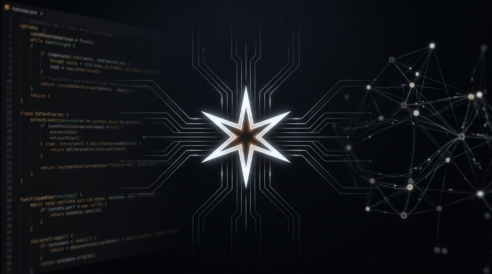

# continue-comstar



A fork of [Continue](https://github.com/continuedev/continue) wired to
[agentic-orchestration](https://github.com/zlatko-lakisic/agentic-orchestration)
via [AO Reach v0.11.0](https://github.com/zlatko-lakisic/agentic-orchestration-reach/releases/tag/v0.11.0).
Instead of calling an LLM provider directly, every inference request goes to your
orchestration daemon, which handles model selection, agent routing, tool use,
session memory, and the learning loop.

## What this is

continue-comstar is the editor face of the COMSTAR project. The orchestration daemon is the brain; this extension is its editor I/O. It captures context from the editor, forwards that context through AO Reach, and streams the response back into VS Code. The extension does not know which model answered, and it does not need to.

## Why

Continue is the best open-source code assistant shell. AO Reach gives it a backend with persistent memory, dynamic planning, and MCP tools—capabilities that a direct inference provider cannot match.

## Prerequisites

| Component               | Requirement                                                                                                     |
| ----------------------- | --------------------------------------------------------------------------------------------------------------- |
| AO Reach protocol       | v0.11.0 or newer (per-turn cancel support)                                                                      |
| `agentic-orchestration` | Daemon with `AGENTIC_SERVE_SESSION_OVERLAY=1` and `AGENTIC_SERVE_MCP_TUNNEL=1` (for workspace filesystem tools) |
| Optional streaming      | `AGENTIC_SERVE_STREAM_STDOUT=1` and/or `AGENTIC_SERVE_STREAM_THOUGHTS=1` on the engine                          |
| Optional mTLS           | Engine requires client certs; enroll once and set `mtlsMaterialDir`                                             |
| VS Code                 | Version 1.85 or newer                                                                                           |

No third-party account is required. The extension requires an AO Reach API token (`apiKey` / `AO_REACH_TOKEN`) and sends identity headers (`x-agentic-session-id`, `x-agentic-user-name`). On mTLS-only deploys, also provide enrolled `cert.pem` / `key.pem` / `ca.pem`.

## Installation

```bash
# clone and build
git clone https://github.com/zlatko-lakisic/continue-comstar
cd continue-comstar
npm install
npm run build         # builds the VS Code extension
```

Install the generated `.vsix` from `extensions/vscode/`, or open the repository in VS Code and press F5 to run the extension in development mode.

## Configuration

Create or replace your Continue `config.yaml` with profiles like these:

```yaml
name: continue-comstar
version: 0.0.1
schema: v1

models:
  - name: COMSTAR Code
    provider: ao_reach
    baseUrl: wss://ao.lan:8765
    apiKey: $AO_REACH_TOKEN
    sessionOverlay: comstar-code
    timeoutSeconds: 15
    streamingEnabled: true
    # mtlsMaterialDir: ~/.continue-comstar/ao-mtls
    # filesystemTunnel: true

  - name: COMSTAR Review
    provider: ao_reach
    baseUrl: wss://ao.lan:8765
    apiKey: $AO_REACH_TOKEN
    sessionOverlay: comstar-code-review
    sessionId: continue-comstar-review
    timeoutSeconds: 30
    streamingEnabled: true
```

| Field              | Meaning                                                                                         |
| ------------------ | ----------------------------------------------------------------------------------------------- |
| `baseUrl`          | Engine URL (`wss://`, `ws://`, `https://`, or `http://`); Continue connects to `/ws`            |
| `apiKey`           | Required token (`AO_REACH_TOKEN` if omitted / `$AO_REACH_TOKEN`)                                |
| `sessionOverlay`   | Overlay pack name under repo `overlays/` (registered on connect via `session_overlay_register`) |
| `sessionId`        | Optional stable session id; default `continue-comstar-{workspaceName}`                          |
| `timeoutSeconds`   | Hard deadline; Continue also sends `cancel` for that turn                                       |
| `streamingEnabled` | When true, yields thinking + assistant chunks as they arrive                                    |
| `mtlsMaterialDir`  | Optional folder with `cert.pem`, `key.pem`, `ca.pem` (or env `AO_REACH_MTLS_DIR`)               |
| `filesystemTunnel` | Default true; tunnels the open workspace as `client.filesystem_local` (in-process MCP)          |

Each profile selects a **shipped overlay pack** (`overlays/comstar-code`, `overlays/comstar-code-review`), not a remote named server overlay. Stop in the UI sends `{ type: cancel, questionId }` so the engine ends that run without dropping the socket.

## Session overlays

continue-comstar ships overlay packs under `overlays/<sessionOverlay>/` (for example
`overlays/comstar-code`). On connect, AOReach packs those YAML agents, registers
them with `session_overlay_register` (`appId: continue-comstar`), and tunnels the
open workspace as `client.filesystem_local` (in-process MCP). Edit the pack on
disk to change agent personality, model, or tools — then reconnect.

Example agent file:

```yaml
# overlays/comstar-code/agent_providers/code_assistant.yaml
id: code_assistant
type: ollama
name: Code assistant
role: VS Code code assistant via continue-comstar
goal: Answer with precise working code from editor and workspace context
model: qwen2.5:14b-instruct
selfcontained: false
mcp_providers:
  - filesystem_local
system_prompt: |
  You receive editor context and answer with precise working code.
```

The same overlay directory can contain a `documentation_lookup` agent with access to the project documentation source. Model choice, agent personality, tool access, verbosity, and response length all live in this overlay, not in the extension configuration.

## Session memory

An AO Reach session persists across IDE restarts because it is keyed by the configured or derived `sessionId`. The orchestration daemon's SQLite knowledge base accumulates knowledge about the codebase over time. Users can clear a session on the server; the extension itself holds no persistent session state.

## Privacy

The extension sends no code to a cloud service. All routing goes only to the URL configured in `baseUrl`. If that URL is on your LAN, nothing leaves your network unless a server-side overlay calls an external API, which is entirely under your control.

## Part of the COMSTAR project

COMSTAR is a family of interfaces to the same `agentic-orchestration` backend: a voice-assistant terminal and now an editor extension. See the [COMSTAR project](https://github.com/zlatko-lakisic/comstar) for the wider set of interfaces.

## Licence

Apache-2.0, the same licence as upstream Continue and agentic-orchestration.
