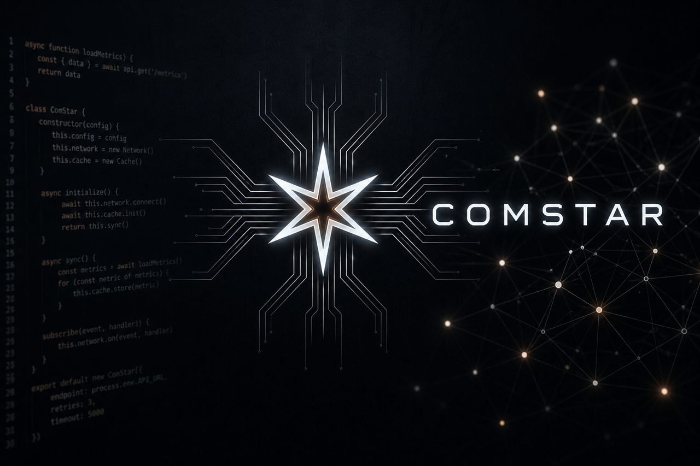

<div align="center">



<a href="https://opensource.org/licenses/Apache-2.0">
  
</a>
<a href="https://github.com/zlatko-lakisic/agentic-orchestration-reach/releases/tag/v0.12.0">
  
</a>

# Comstar

Editor I/O for the COMSTAR agentic-orchestration daemon. Every chat, edit, and agent turn is routed through [AO Reach](https://github.com/zlatko-lakisic/agentic-orchestration-reach) to your own engine — no cloud account, no code leaving your network unless you configure it that way.

</div>

## What it does

Comstar captures editor context in VS Code, sends it to `agentic-orchestration` over AO Reach, and streams the reply back. Model selection, planning, tools, and session memory live on the daemon. The extension does not know which model answered.

Requires an AO Reach token (`apiKey` / `AO_REACH_TOKEN`) and a running engine with session overlays and MCP tunnel enabled.

## Configuration

Create or replace `config.yaml` with a COMSTAR profile:

```yaml
name: comstar
version: 0.0.1
schema: v1

models:
  - name: COMSTAR Code
    provider: ao_reach
    baseUrl: wss://ao.lan:8765
    apiKey: $AO_REACH_TOKEN
    sessionOverlay: comstar-code
    timeoutSeconds: 300
    streamingEnabled: true
```

| Field             | Meaning                                                                    |
| ----------------- | -------------------------------------------------------------------------- |
| `baseUrl`         | Engine URL (`wss://`, `ws://`, `https://`, or `http://`)                   |
| `apiKey`          | AO Reach token                                                             |
| `sessionOverlay`  | Shipped pack under `overlays/` (`comstar-code`, `comstar-code-review`)     |
| `agentDefinition` | Path to your own agent YAML or overlay folder (overrides `sessionOverlay`) |
| `timeoutSeconds`  | Seconds of silence from AO before giving up (`0` waits forever)            |

Docs and install: [continue-comstar on GitHub](https://github.com/zlatko-lakisic/continue-comstar).

## License

[Apache 2.0](./LICENSE). Part of the [COMSTAR](https://github.com/zlatko-lakisic/comstar) project.
